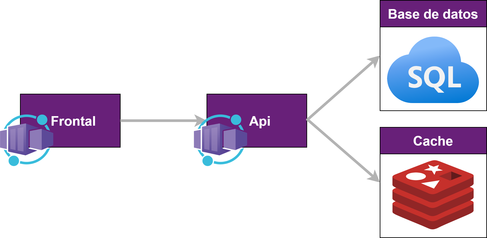
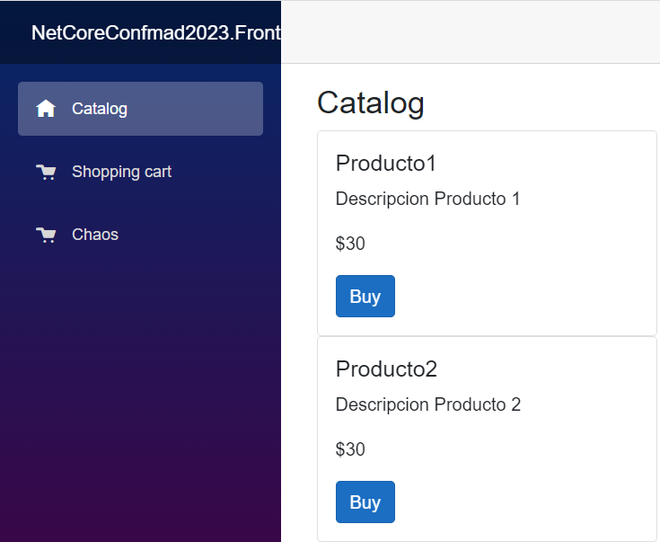
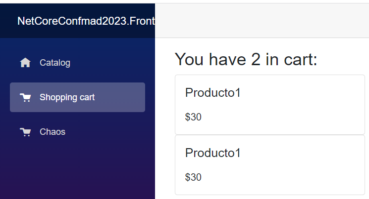
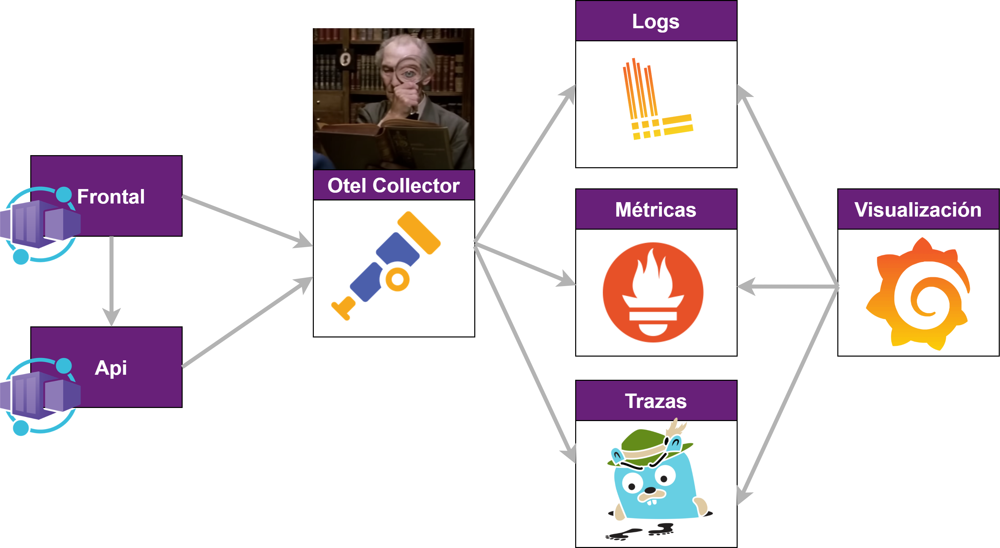
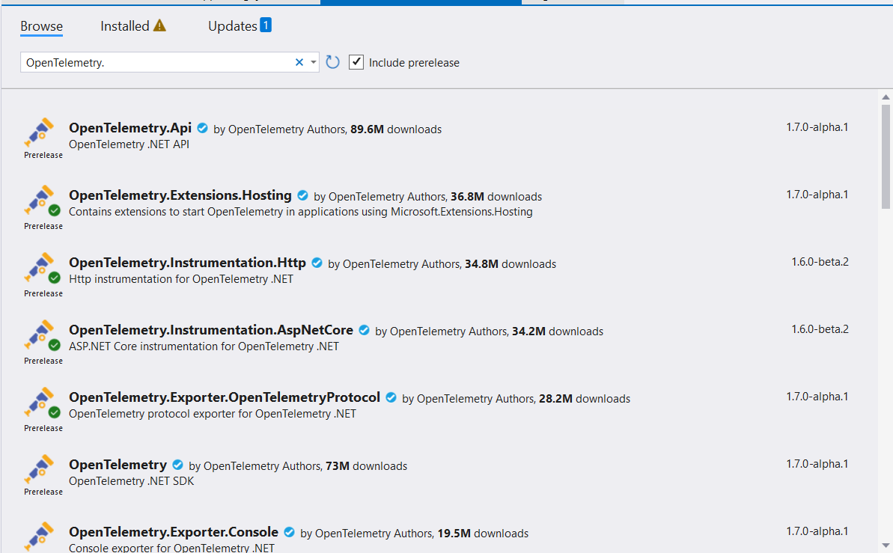

# Charla "Mi aplicación no funciona y no se porqué"

En este repositorio está la aplicación de ejemplo usada para la charla así como la presentación de la misma.

La aplicación consiste de:

## Presentación

La presentación podéis descargarla de la carpeta **presentacion** de este mismo repositorio

## Arquitectura de la aplicación de ejemplo



Es una aplicación muy sencilla con:

1. Un Frontal en Blazor en .Net 7.0.

   - Este frontal tiene 2 partes únicamente que son:

     1. Un catálogo de productos donde dandole al botón Buy  metes productos en un carrito de la compra.

        

     2. Un carrito de la compra donde ves los productos que has dado a comprar.

   

2. Una Api en .Net 7.0

   - Esta Api consume una base de datos en Azure SQL que obtiene un listado de productos.
   - Además se conecta con una cache de Redis donde se almacenan los productos de la compra.

## Arquitectura Observabilidad




Las aplicaciones envían la información Otel Collector.  Otel Collector se encarga de modificar, enriquecer modificar los datos recibidos, es decir las trazas , las métricas y los logs. Una vez realizados los cambios pertinentes Otel enviará la información a cada uno de los sistemas.

Estos sistemas son:

- En los logs vamos a usar Loki.
- En las métricas vamos a usar Prometheus.
- En el caso de las trazas  vamos a usar Jaeger.

Por último para poder consultar toda esta información de manera consolidada en un único sitio, usamos grafana.

Para tener más información sobre Otel Collector, y los demás sistemas consultar los siguientes enlaces:

- Otel Collector - https://opentelemetry.io/docs/collector/

- Loki - https://grafana.com/docs/loki/latest/

- Prometheus - https://opentelemetry.io/docs/collector/

- Jaeger - https://www.jaegertracing.io/docs/1.50/

- Grafana - https://grafana.com/grafana/

- 

Para poder levantar esta infraestructura de la manera más sencilla hay un Dockercompose en la ruta del repositorio **infrastructure-observability** .

```yaml
version: "2"
services:

  #Redis
  redis:
    image: redis/redis-stack-server:latest
    restart: always
    ports:
      - "6379:6379"
      
  # Jaeger
  jaeger-all-in-one:
    image: jaegertracing/all-in-one:latest
    restart: always
    ports:
      - "16686:16686"
      - "14268"
      - "14250"
      - "4327:4317"
    networks:
      - practical-otel-net  

# Loki
  loki:
    image: grafana/loki:latest
    command: [ "-config.file=/etc/loki/local-config.yaml" ] 
    networks:
      - practical-otel-net  

#Grafana
  grafana:
    image: grafana/grafana:latest
    ports:
      - "3000:3000"
    volumes:
      - ./grafana-datasources.yaml:/etc/grafana/provisioning/datasources/datasources.yaml
    environment:
      - GF_AUTH_ANONYMOUS_ENABLED=true
      - GF_AUTH_ANONYMOUS_ORG_ROLE=Admin
      - GF_AUTH_DISABLE_LOGIN_FORM=true
    depends_on:
      - jaeger-all-in-one
      - prometheus
      - loki
      - otel-collector
    networks:
      - practical-otel-net  

  # Collector
  otel-collector:
    image: otel/opentelemetry-collector-contrib:latest
    restart: always
    command: ["--config=/etc/otel-collector-config.yaml"]
    volumes:
      - ./otel-collector-config.yaml:/etc/otel-collector-config.yaml
    ports:
      - "1888:1888"   # pprof extension
      - "8888:8888"   # Prometheus metrics exposed by the collector
      - "8889:8889"   # Prometheus exporter metrics
      - "13133:13133" # health_check extension
      - "4317:4317"   # OTLP gRPC receiver
      - "55679:55679" # zpages extension
    depends_on:
      - jaeger-all-in-one
    networks:
      - practical-otel-net  

  prometheus:
    image: prom/prometheus:latest
    restart: always
    volumes:
      - ./prometheus.yaml:/etc/prometheus/prometheus.yml
    ports:
      - "9090:9090"
    networks:
      - practical-otel-net  

networks:
  practical-otel-net:
    name: practical-otel-net
```

  La configuración del Otel collector está disponible en el fichero **otel-collector-config.yaml** dentro también de la carpeta **infrastructure-observability** .

```yaml
receivers:
  otlp:
    protocols:
      grpc:

exporters:
  logging:
    loglevel: info

  prometheus:
    endpoint: "0.0.0.0:8889"
    const_labels:
      label1: value1

  debug:

  otlp:
    endpoint: jaeger-all-in-one:4317
    tls:
      insecure: true

  loki:
    endpoint: "http://loki:3100/loki/api/v1/push"
    tls:
      insecure: true
    
processors:
  attributes:
    actions:
    - action: insert
      key: loki.attribute.labels
      value: host.name
  
  resource:
    attributes:
    - action: insert
      key: loki.attribute.labels
      value: service.name
    - action: insert
      key: loki.resource.labels
      value: host.name,  service.instance.id
  batch:
  
extensions:
  health_check:
  pprof:
    endpoint: :1888
  zpages:
    endpoint: :55679

service:
  extensions: [pprof, zpages, health_check]
  pipelines:
    traces:
      receivers: [otlp]
      processors: [batch]
      exporters: [debug, otlp]
    metrics:
      receivers: [otlp]
      processors: [batch]
      exporters: [debug, prometheus]
    logs:
      receivers: [otlp]
      processors: [batch]
      exporters: [logging, loki]

```

Para ver como crear este fichero de configuración, consultar el siguiente enlace: https://opentelemetry.io/docs/collector/configuration/ 

## Configurar OpenTelemetry en .Net Core

##### Frontal

En el proyecto del frontal hemos tenido que añadir las siguientes librerías:

- OpenTelemetry.Exporter.OpenTelemetryProtocol

- OpenTelemetry.Extensions.Hosting
- OpenTelemetry.Instrumentation.AspNetCore
- OpenTelemetry.Instrumentation.Http

Como se puede observar todas las librerías caen dentro del namespace **OpenTelemetry**. Nada más que buscar paquetes de nuget por OpenTelemetry, y verás que ya hay bastantes paquetes actualmente disponibles:



En el caso del proyecto del frontal, tenemos la siguiente configuración para habilitar únicamente las trazas:

```c#
builder.Services.AddOpenTelemetry().WithTracing(builder =>
{
    builder.AddAspNetCoreInstrumentation()
        .AddHttpClientInstrumentation()
        .SetResourceBuilder(ResourceBuilder.CreateDefault().AddService(observabilityOptions.ServiceName))
        .AddOtlpExporter(opts =>
        {
            opts.Endpoint = new Uri(observabilityOptions.CollectorUrl);
        });
});
```

Destacar en esta configuración que a través de la propiedad **Endpoint** decimos la url donde nuestro Otel Collector va a estar escuchando.

##### Api

Si vamos al proyecto de la api, hemos tenido que instalar más paquetes que son:

- OpenTelemetry.Exporter.OpenTelemetryProtocol
- OpenTelemetry.Exporter.Prometheus.AspNetCore
- OpenTelemetry.Extensions.Hosting
- OpenTelemetry.Instrumentation.AspNetCore
- OpenTelemetry.Instrumentation.EntityFrameworkCore
- OpenTelemetry.Instrumentation.Http
- OpenTelemetry.Instrumentation.Process
- OpenTelemetry.Instrumentation.Runtime
- OpenTelemetry.Instrumentation.SqlClient
- OpenTelemetry.Instrumentation.StackExchangeRedis

Además debido al uso de Serilog como nuestro framework de logging hemos instalado las siguientes librerías:

- Serilog.AspNetCore
- Serilog.Enrichers.Environment
- Serilog.Enrichers.Thread
- Serilog.Sinks.Console
- Serilog.Sinks.OpenTelemetry

En el caso de la API hemos configurado todo, es decir las métricas los logs y las trazas.

En el caso de la métricas la configuración ha sido la siguiente:

```c#
 var meters = new NetCoreConf2023Metrics();

 builder.WithMetrics(metrics =>
 {           
     var meter = new Meter(observabilityOptions.ServiceName);

     metrics
         .AddMeter(meter.Name)
          .AddMeter(meters.MetricName)
         .SetResourceBuilder(ResourceBuilder.CreateDefault().AddService(meter.Name))
         .AddRuntimeInstrumentation()
         .AddProcessInstrumentation()
         .AddAspNetCoreInstrumentation();
     metrics
         .AddOtlpExporter(options =>
         {
             options.Endpoint = observabilityOptions.CollectorUri;
             options.ExportProcessorType = ExportProcessorType.Batch;
             options.Protocol = OpenTelemetry.Exporter.OtlpExportProtocol.Grpc;
         });
 });

 builder.Services.AddSingleton<NetCoreConf2023Metrics>(meters);
```

Destacar en esta configuración, la agregación de métricas customs  (línea **.AddMeter(meters.MetricName)**). 

Para saber más sobre métricas, ver este post de Fernando Escolar en su blog:

https://www.developerro.com/2023/09/20/dotnet-metrics/

En el caso de los logs la configuración ha sido la siguiente:

```c#
    var environment = context.HostingEnvironment.EnvironmentName;
    var configuration = context.Configuration;

    ObservabilityOptions observabilityOptions = new();

    configuration
        .GetSection(nameof(ObservabilityOptions))
        .Bind(observabilityOptions);

    var serilogSection = $"{nameof(ObservabilityOptions)}:{nameof(ObservabilityOptions)}:Serilog";

    var config = context.Configuration.GetRequiredSection("ObservabilityOptions:Serilog");

    options
        .ReadFrom.Configuration(config)
        .Enrich.FromLogContext()
        .Enrich.WithEnvironmentVariable(environment)
        .Enrich.WithProperty("ApplicationName", observabilityOptions.ServiceName)
        .WriteTo.Console();

    options.WriteTo.OpenTelemetry(cfg =>
    {
        cfg.Endpoint = $"{observabilityOptions.CollectorUrl}/v1/logs";
        cfg.IncludedData = IncludedData.TraceIdField | IncludedData.SpanIdField;
        cfg.ResourceAttributes = new Dictionary<string, object>
                                    {
                                        {"service.name", observabilityOptions.ServiceName},
                                        {"index", 10},
                                        {"flag", true},
                                        {"value", 3.14}
                                    };
    });

});
```


Por último en el caso de las trazas la configuración ha sido la siguiente:

```c#
    tracing
        .AddSource(observabilityOptions.ServiceName)
        .SetResourceBuilder(ResourceBuilder.CreateDefault().AddService(observabilityOptions.ServiceName))
        .SetErrorStatusOnException()
        .SetSampler(new AlwaysOnSampler())
        .AddAspNetCoreInstrumentation(options =>
        {
            //options.EnableGrpcAspNetCoreSupport = true;
            options.RecordException = true;
        })
        .AddHttpClientInstrumentation()                
        .AddEntityFrameworkCoreInstrumentation(options =>
                {
                    options.EnrichWithIDbCommand = (activity, command) =>
                     {
                         var stateDisplayName = $"{command.CommandType} main";
                         activity.DisplayName = stateDisplayName;
                         activity.SetTag("db.name", stateDisplayName);
                         activity.SetTag("db.query", command.CommandText);
                     };
                })
                .AddRedisInstrumentation()
               .ConfigureRedisInstrumentation((sp, i) =>
                {
                    var cache = (RedisCache)sp.GetRequiredService<IDistributedCache>();
                    var conn = cache.GetConnection();
                    i.AddConnection(cache.GetConnection());
                });

    tracing
        .AddOtlpExporter(options =>
        {
            options.Endpoint = observabilityOptions.CollectorUri;
            options.ExportProcessorType = ExportProcessorType.Batch;
            options.Protocol = OpenTelemetry.Exporter.OtlpExportProtocol.Grpc;
        });
});
```


Para detalles de cómo configurar OpenTelemetry en .Net Core visitar los siguientes enlaces: 

- https://github.com/open-telemetry/opentelemetry-dotnet

- https://opentelemetry.io/docs/instrumentation/net/manual/ 

## Enlaces de interés

- Getting started with OpenTelemetry and distributed tracing in .NET - (https://www.mytechramblings.com/posts/getting-started-with-opentelemetry-and-dotnet-core/)
- ASP.NET Core: Monitoreo con OpenTelemetry y Grafana (https://dev.to/isaacojeda/aspnet-core-monitoreo-con-opentelemetry-y-grafana-57m9)
- OpenTelemetry with Jaeger in .NET Core (https://medium.com/@niteshsinghal85/opentelemetry-with-jaeger-in-net-core-9b1e009a73dc)
- Monitoring a .NET application using OpenTelemetry - (https://www.meziantou.net/monitoring-a-dotnet-application-using-opentelemetry.htm)
- 